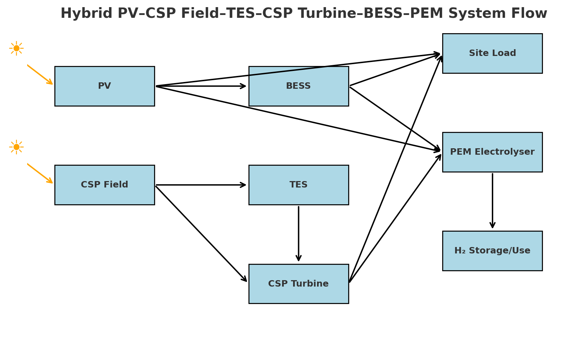

# Fully Decarbonising the Off-Grid Al Jalamid Phosphate Complex 
**MILP Formulation and Techno-Economics for PV–CSP–BESS–PEM Integration**

This repository contains the models, data, and documentation supporting the MSc Business Analytics Individual Research Report (IRR) on optimising a hybrid renewable–hydrogen system for Ma’aden's off-grid Al Jalamid phosphate complex. The site uses diesel for electricity generation and uses heavy fuel oil HFO in the combustion chamber of the dryer. This project aims from partial to full decarbonization of site.

---

## 📜 Overview

## 📊 Key Features
- **Deterministic and CVaR MILP** formulations implemented in MATLAB
- Hourly resolution over single-year (2022) and 10-year NASA POWER irradiance datasets
- Explicit coupling of electrolyser hydrogen output to avoided HFO use, avoided trucking, and monetised carbon credits
- Sensitivity analysis for **CO₂ price**, **production scheduling**, and **reliability constraints**
- Automatic Excel report generation with:
  - Hourly dispatch
  - Monthly totals
  - Summary KPIs
  - Cost breakdown
  - Emissions accounting
  - Assumptions table

---

## 📂 Repository Structure and File Descriptions

### **📁 data/**
Input datasets used by the MILP:
- `irradiance_hourly.mat` – Hourly plane-of-array (GHI) irradiance for PV for 2022
- `dni_hourly.mat` – Hourly direct normal irradiance (DNI) for CSP for 2022
- `irradiance_hourly_2013-2022.mat` – 10-year hourly GHI dataset (2013–2022)
- `dni_hourly_10Y.mat` – 10-year hourly DNI dataset (2013–2022)
- `hourly_H2_demand_100.mat` – Hourly hydrogen demand profile (100% HFO displacement equivalent)
- `diesel_hourly_energy.mat` / `.xlsx` – Hourly site diesel based electricity generation profile (site load proxy)
- **Note:** Leap-day hours are removed to ensure each year has 8,760 hours.

### **📁 src/**
MATLAB source code for model execution:
- `run_milp_milp_v2_lex.m`  
  Main MILP solver for PV + CSP + TES + BESS + PEM electrolyser, deterministic with 2-pass lexicographic optimisation:
  1. **Pass 1:** Minimise unmet site load
  2. **Pass 2:** Fix reliability and minimise net cost (CAPEX + OPEX + penalties − revenues/credits)
    
- `build_and_solve_milp_v2_lex_CVaR.m`
  CVaR-aware MILP variant optimising for site electricity load and H₂

- `build_and_solve_milp_siteonly_CVaR.m`
  CVaR-aware MILP variant optimising only for site electricity load (H₂ from surplus, post-hoc)
  
- Helper functions for:
  - Data alignment (irradiance, DNI, load, H₂ demand)
  - Leap-day trimming
  - Gap-filling (linear interpolation for ≤3h gaps)
  - Output struct unpacking and Excel writing

### **📁 results/**
Example model outputs (Excel):
- Hourly dispatch profiles
- Monthly aggregates
- Summary KPIs (CAPEX, OPEX, Net Cost, production, emissions)
- Cost breakdown (by subsystem)
- Emissions (CO₂, CH₄, N₂O avoided)
- Assumptions (all `unit` and `econ` parameters used)

### **📁 docs/**
Project documentation:
- Final MSc IRR PDF
- Appendices with cost benchmarks, carbon pricing scenarios, and operational assumptions

---

## 🖥 Requirements
- MATLAB **R2023a** or later
- Optimization Toolbox
- NASA POWER API access *(optional)* for dataset updates

---

## 📄 License
MIT License – see [LICENSE](LICENSE) file.

---

## 📚 Citation
If you use this code or data, please cite:
> Moreira, F. (2025). *Fully Decarbonising the Off-Grid Al Jalamid Phosphate Complex: MILP Formulation and Techno-Economics*. MSc IRR, Imperial College London.
